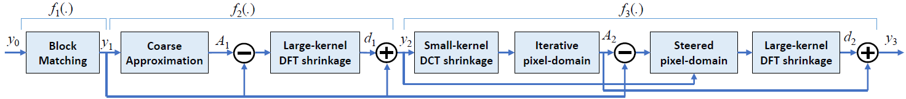
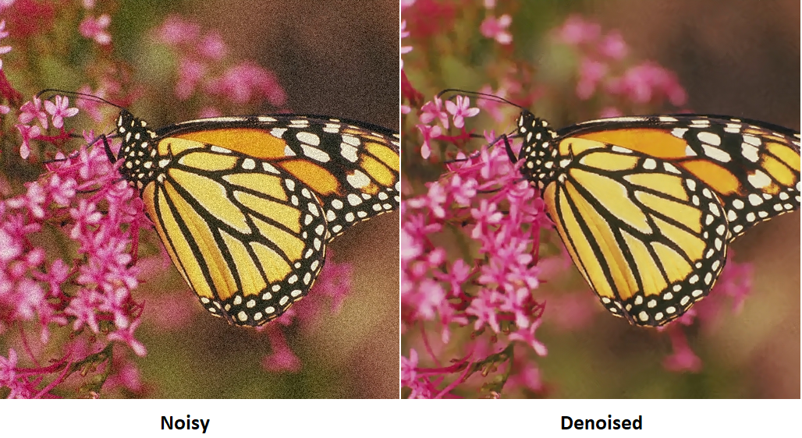
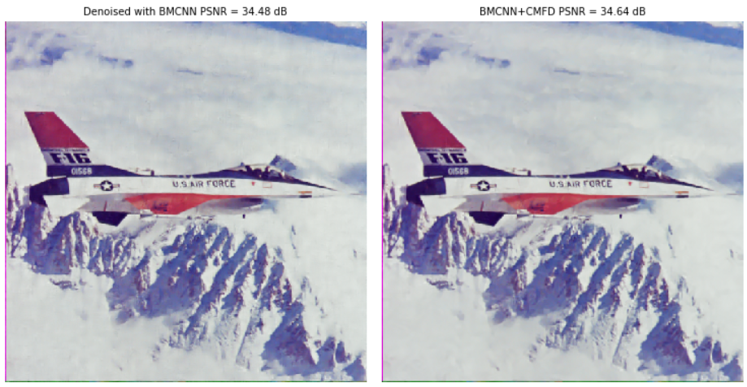

# Cascaded Multi-Domain Filter for Fast Image Denoising

This is an implementation of [CMDF](https://link.springer.com/article/10.1007/s11554-019-00868-9).
 on Python and Matlab. See also [CMDF](https://users.encs.concordia.ca/~amer/CMDF/).
CMDF integrates different fast denoising methods efficiently to gain
both quality and speed.
Here is the block diagram of the cascaded multi-domain.

Here is a sample denoising result.

We can use CMDF to boost other densoing methods. See [demo.ipynb](/Python/demo.ipynb).
Here is a sample of boosted BMCNN.

**The repository includes:**
* Python package for CMDF and BMCNN.
* Matlab package for CMDF.
* Jupyter notebooks to visualize the denoising results.
* Test images.
* Trained weights for BMCNN.

## Getting Started with Python
* [demo.ipynb](Python/demo.ipynb) is the fastest way to start. 
It shows an example of using CMDF. It also shows the integration CMDF to other methods (here BMCNN).

* [denoise_cmdf.py](Python/denoise_cmdf.py): This file contains the main CMDF implementation.

# Getting Started with Matlab (Windows only)
* [demo.m](Matlab/demo.m) Is the fastest way to start. 

## Installation (Python)
1. Install dependencies

   pip3 install package [numpy, skimage, ...]

2. Clone this repository

3. Run setup from the `Python/libs` directory
    
    python3 setup.py install

	**or**:
	if python version is 3.6 copy module files (*.pyd for windows and *.so for linux to your working directory) 	
     
4. (optional for BMCNN-CMDF) Run setup from the `bmcnn/libs` directory

    python3 setup.py install
